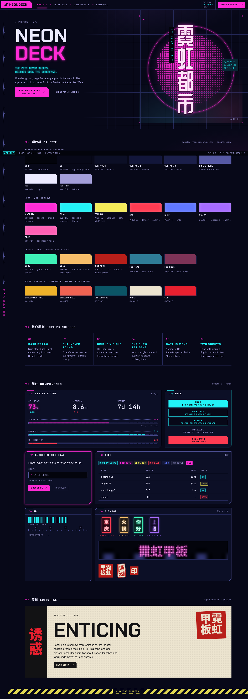

# NEONDECK

A cyberpunk design system for Svelte 5: tokens, components and a design language, with a palette checked against WCAG 2.2 AA.
Every app and site in [arkane-dev](https://github.com/arkane-dev) is built with it.



Projects expect this repo in a folder named `sharable_assets`, beside them:
```bash
git clone https://github.com/arkane-dev/neondeck sharable_assets
```
The npm package (`@cyberpunk-apps/neondeck`) is private and installs from that folder. It is never on the npm registry.

- `DESIGN_LANGUAGE.md`: the NEONDECK design language. Read this first.
- `neondeck/`: Svelte 5 library with the tokens, base CSS, effects and components. Its `src/routes/+page.svelte` is the living showcase.
- `reference/`: screenshots of the showcase (desktop + mobile) to check new work against.

## Setup (standard: uv venv + nodeenv)
```bash
cd sharable_assets
uv venv .venv && uv pip install --python .venv nodeenv
.venv/bin/nodeenv -p --node=lts      # installs node/npm into the venv
source .venv/bin/activate
cd neondeck && npm install
npm run dev        # showcase at http://localhost:5173
npm run build      # builds dist/ (tokens.json regenerated, publint checked)
npm run check      # svelte-check
```

## License

[MIT](LICENSE) © 2026 Andrew R. Kane
